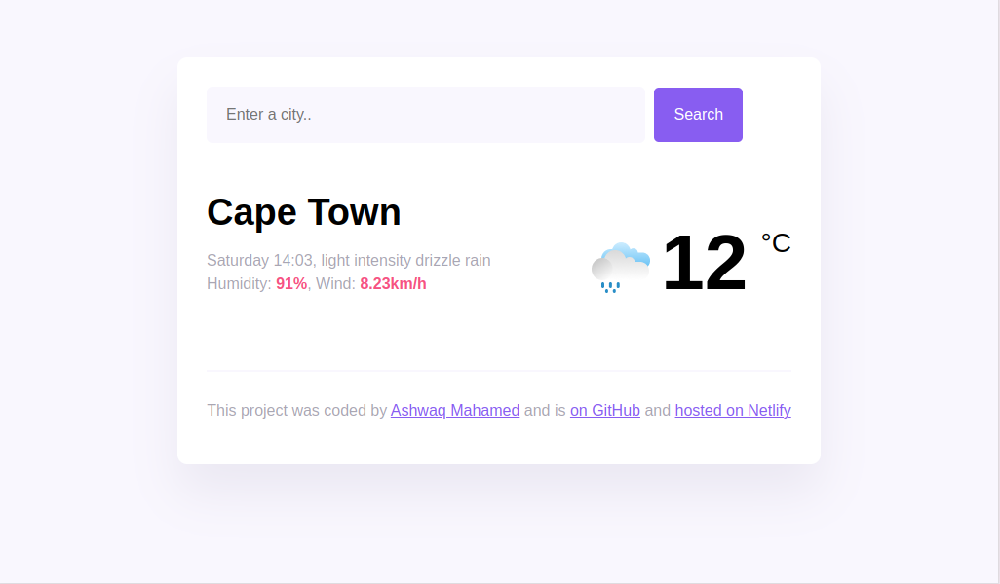

# Weather App

This is a weather application that allows users to search for current weather information by city. The application provides details such as temperature, humidity, wind speed, and a brief weather description. This project demonstrates how to fetch and display weather data using a weather API.

## Table of contents

- [Overview](#overview)
  - [Screenshot](#screenshot)
  - [Links](#links)
- [My process](#my-process)
  - [Built with](#built-with)
- [Author](#author)

## Overview

### Screenshot

### Links

- Live Site URL: [live site](https://tubular-fox-1909d2.netlify.app/)

## My process

### Built with

- Semantic HTML5 markup
- CSS custom properties
- Flexbox
- Vanilla JavaScript for DOM manipulation
- Axios for API requests to fetch weather data

## Author

- Linkedin - [@ashwaqmahamed](https://www.linkedin.com/in/ashwaq-mahamed-581ab7299/)
